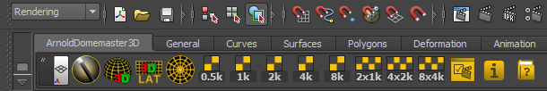
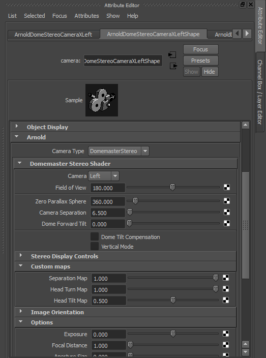

# Arnold MtoA DomemasterStereo #

## Overview ##

The DomemasterStereo shader is added to a Maya scene using the ArnoldDomemaster3D Shelf tool. 

When you run the DomemasterStereo shelf tool it adds a custom ArnoldDomemasterStereo camera rig to the scene that has the left and right cameras set up automatically. The left camera DomemasterStereo attributes are used to drive the stereoscopic settings for both the left and right cameras. This means you only have to change the **Zero Parallax Sphere** or **Camera Separation** setting in one place.

To change the DomemasterStereo attributes, select the camera in your scene. Open the attribute editor and switch to the camera's shape node. The lens shader is listed in the Arnold section.

## Known Issues ##

The current version of the Arnold Domemaster3D shaders (as of 2014-11-23) are a development build. At this point in time there is no easy way to create screen space texture maps using Arnold's MtoA and SItoA render nodes. This means a solution has to be developed inside the Domemaster3D shaders that will remap an existing texture map into screen space coordinates.

At this point, the DomemasterStereo shader will render a stereo fulldome image but you will notice something that looks like a small "swirly region" in the zenith part of the fulldome frame. This is due to a lack of a screen space turn map texture. 

## Domemaster Stereo Shader Controls ##

**Camera**: Choices are **Center**/**Left**/**Right**. Selects the camera to use for rendering. **Center** skips 90% of the calculations and gives you a highly optimized standard latlong image.

**Field of View**: Controls the field of view for the rendered angular fisheye image. A "Domemaster" formatted image has a 180 degree field of view, and a "light probe" style angular image has a 360 degree field of view.

**Zero Parallax Sphere** (focus plane): This is the distance at which the left and right camera's line of sight converges.

**Camera Separation**: The initial separation of the left and right cameras.

**Dome Forward Tilt**: Dome tilt in degrees. Note that this value is not used unless you enable Dome Tilt Compensation.

**Dome Tilt Compensation**: Enabling this option, shifts all the calculations by the # of degrees specified in **Dome Forward Tilt**. Basically, it keeps the fulldome cameras / viewer's head vertical while the dome rotates forward.

**Vertical Mode**: Enables the vertical dome mode which automatically adjusts the head turn setting and adds a turn compensation for the upper and lower part of the dome. It's a simplified and optimized version of the Dome Tilt Compensation with a 90 degree tilt angle, but with a different automatic handling of the top and bottom pinch correction. It is faster and easier to use.

### Custom Maps ###
**Separation Map**: A value between 0-1 that multiples the **Camera Separation**. This attribute is meant to be used with a grayscale texture mapped to the screen space. It's used to control the amount of 3D effect, and eliminate it where desired.

**Head Turn Map**: A value 0-1 that controls the amount of the head turn. This attribute is meant to be used with a grayscale texture mapped using the screen space. Typical use, keep the head straight while looking at the top of the dome.

**Head Tilt Map**: A value 0-1 (with 0.5 being the "neutral" value) that tilts the cameras (or head) left/right. This attribute is meant to be used with a grayscale texture mapped using the screen space. 0 means 90 degrees to the left, 1 means 90 degrees to the right.

### Image Orientation ###

**Flip X**: Flips the view horizontally

**Flip Y**: Flips the view vertically

### Options ###

**Exposure**: This attribute allows you to control the overall brightness of the final rendered frame.

## Screen Space Texture Maps ##

You can control the stereoscopic effect seen in the DomemasterStereo shader with the help of control texture maps.

The `Domemaster Stereo Shader` shader's **Separation Multiplier**, **Turn Multiplier**, **Head Tilt** attributes support control texture mapping. The images have to be applied using screen space coordinates.

