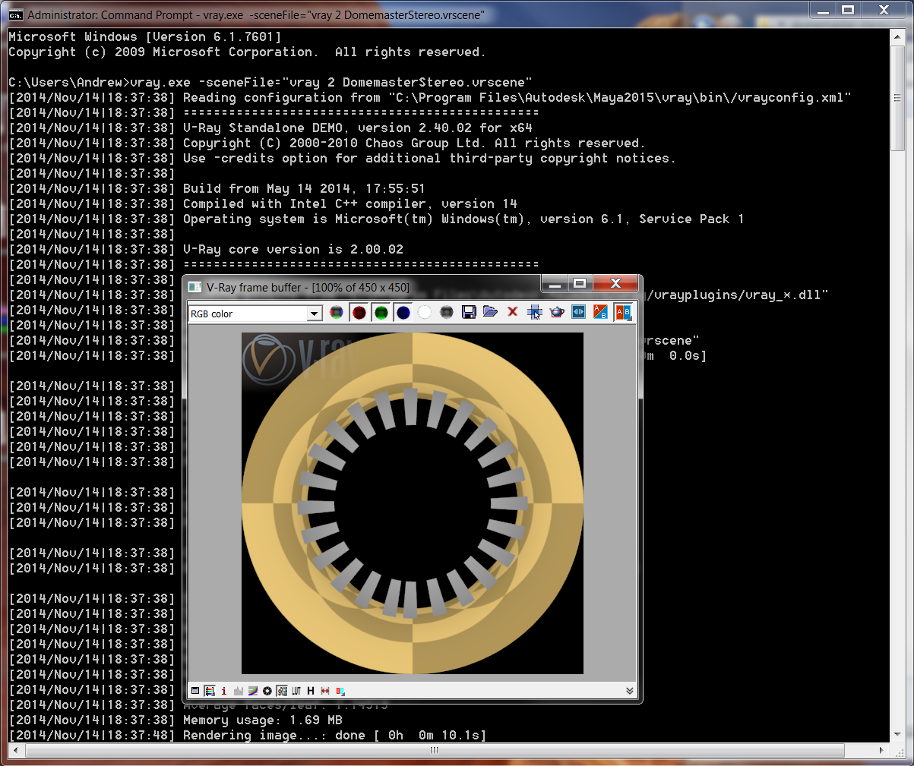
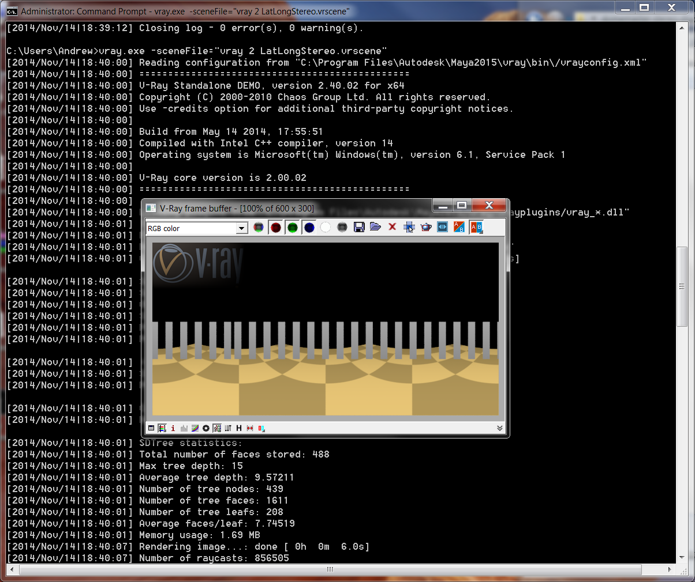
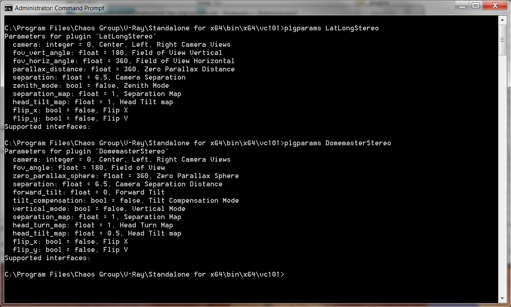
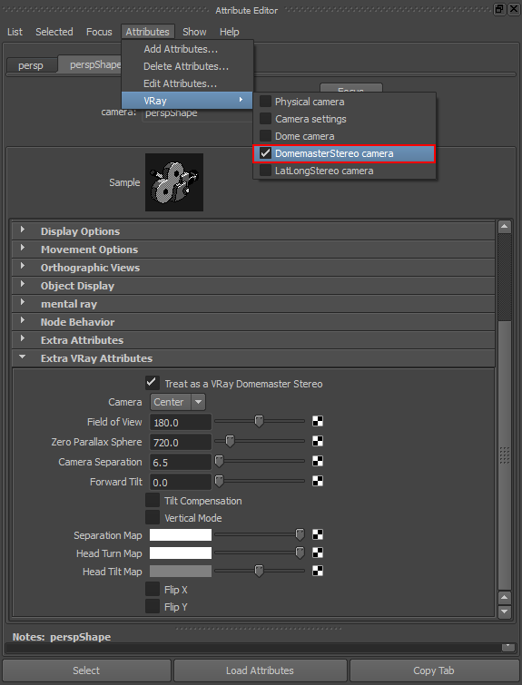
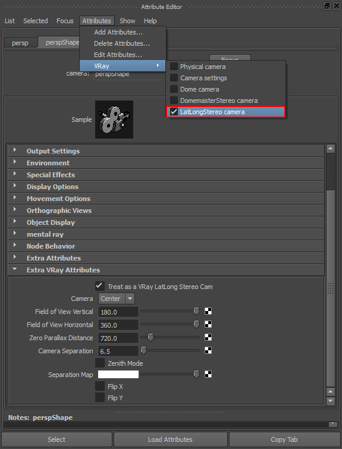

# Vray Domemaster3D Guide #
-------------------------
2014-12-24 09.01 am

## Overview ##

The Domemaster Stereo Shader is a set of fulldome stereo and latlong stereo production lens shaders for 3DS Max, Maya, Softimage, Houdini, Maxwell Studio, Mental Ray Standalone, Vray Standalone, and Arnold Standalone. The lens shaders are available for Mental Ray, Vray, and Arnold, and comes integrated in Maxwell Render version 3.1+.

This guide covers the Vray version of the Domemaster Stereo Shader.

## Known Issues ##

The current version of the Vray Domemaster3D shaders (as of 2014-12-24) is a development build.

The Vray Standalone version generally works without too many issues.

More work needs to be done to apply a black overlay to the circular outside area of the domemaster frame. Right now the DomemasterStereo shader will fill the outside circular area in the frame with a solid color based upon the current data at the 0/0/0 X/Y/Z ray angle. Also the shader doesn't apply a circular alpha channel overlay yet.

The Maya integration is still a work in progress. The Domemaster3D shaders aren't yet active in the Maya render view. Also, the custom Vray Extra Attributes haven't been linked into the Vray for Maya .vrscene exporter.

The initial 3DS Max source code has been added in this v0.3 release but the GUI elements need to be completed and there is a `LibDescription` error in the source code/makefile that gives an error during compiling.

## Vray Standalone ##

Right now the DomemasterStereo and LatLongStereo shaders are accessible from Vray Standalone 2.0 / 3.0 using the `vray.exe` command line program.

### DomemasterStereo in a VRSCENE File ###

You can upgrade a regular Vray camera (in this case named RenderCamShape) to a DomemasterStereo camera by by pasting the following text in a .vrscene file:
	
	DomemasterStereo RenderCamShape {
	  camera=0;
	  fov_angle=360.0;
	  zero_parallax_sphere=355.0;
	  separation=6.5;
	  forward_tilt=0.0;
	  tilt_compensation=0;
	  vertical_mode=1;
	  separation_map=1.0;
	  head_turn_map=1.0;
	  head_tilt_map=0.5;
	  flip_x=0;
	  flip_y=0;
	}

You can test this code out using the included vray example scene "vray 2 DomemasterStereo.vrscene". To render the sample scene launch vray standalone from the command prompt with:
     
	vray.exe -sceneFile="vray 2 DomemasterStereo.vrscene"

### LatLongStereo in a VRSCENE File ###

You can upgrade a regular Vray camera (in this case named RenderCamShape) to a LatLongStereo camera by by pasting the following text in a .vrscene file:

	LatLongStereo RenderCamShape {
	  camera=0;
	  fov_vert_angle=180.0;
	  fov_horiz_angle=360.0;
	  parallax_distance=355;
	  separation=6.5;
	  zenith_mode=1;
	  separation_map=1;
	}

You can test this code out using the included vray example scene "vray 2 LatLongStereo.vrscene". To render the sample scene launch vray standalone from the command prompt with:
      
    vray.exe -sceneFile="vray 2 LatLongStereo.vrscene" 

## Vray Standalone Shader Installation ##

### Windows 64-bit ###

**Step 1.** Download the [Visual Studio 2012 (VC++ 11.0) Redistributable Package](http://www.microsoft.com/en-us/download/details.aspx?id=30679).

**Step 2.** Copy the .dll files to the vray-plugins directory:  

`H:\Program Files\Chaos Group\V-Ray\Standalone for x64\bin\x64\vc101\plugins`

Vray Plugin Files:

    vray_DomemasterStereo.dll
    vray_LatLongStereo.dll

**Step 3.** Edit the Windows environment variables and add an entry for the  `VRAY_PLUGINS_x64` vray standalone plugins path location.

For Vray Standalone 2.0 the standard `VRAY_PLUGINS_x64` setting would be:   

`VRAY_PLUGINS_x64`  
`C:\Program Files\Chaos Group\V-Ray\Standalone for x64\bin\x64\vc101\plugins`

## Verify the Shader is Loaded in Vray ##

### Vray Shader Parameters Screenshot ###

### Listing the Nodes ###

You can list all of the active Vray Shader nodes using the plugin parameters tool:

#### Windows Node List ####

`cd C:\Program Files\Chaos Group\V-Ray\Standalone for x64\bin\x64\vc101\`  
`plgparams.exe -list`

#### Mac Node List ####

`cd /Applications/ChaosGroup/V-Ray/Standalone_for_snow_leopard_x86/bin/snow_leopard_x86/gcc-4.2/`  
`./plgparams.bin -list`

#### Linux Node List ####

`./plgparams.bin -list`

### DomemasterStereo Node Parameters ###

If you run the plgparams with the shader name listed you can see the individual node parameters. If you get a plgparams error asking for the -plugindir that means you are missing the vray plugins environment variable such as `VRAY_PLUGINS_x64` or `VRAY_PLUGINS_x86`.
	
#### plgparams.exe DomemasterStereo ####

	Parameters for plugin 'DomemasterStereo'
	  camera: integer = 0, Center, Left, Right Camera Views
	  fov_angle: float = 180, Field of View
	  zero_parallax_sphere: float = 360, Zero Parallax Sphere
	  separation: float = 6.5, Camera Separation Distance
	  forward_tilt: float = 0, Forward Tilt
	  tilt_compensation: bool = false, Tilt Compensation Mode
	  vertical_mode: bool = false, Vertical Mode
	  separation_map: float = 1, Separation Map
	  head_turn_map: float = 1, Head Turn Map
	  head_tilt_map: float = 0.5, Head Tilt map
	  flip_x: bool = false, Flip X
	  flip_y: bool = false, Flip Y

#### plgparams.exe LatLongStereo ####

	Parameters for plugin 'LatLongStereo'
	  camera: integer = 0, Center, Left, Right Camera Views
	  fov_vert_angle: float = 180, Field of View Vertical
	  fov_horiz_angle: float = 360, Field of View Horizontal
	  parallax_distance: float = 360, Zero Parallax Distance
	  separation: float = 6.5, Camera Separation
	  zenith_mode: bool = false, Zenith Mode
	  separation_map: float = 1, Separation Map
	  head_tilt_map: float = 1, Head Tilt map
	  flip_x: bool = false, Flip X
	  flip_y: bool = false, Flip Y

**Note:** If you receive the following error message it means you have tried to load a Vray 2.0 shader in Vray 3.0:  

    // Error: Error loading plugin library "C:\Program Files\Autodesk\Maya2015\vray\vrayplugins\vray_DomemasterStereo.dll" (127): The specified procedure could not be found. //   
    // Error: Error loading plugin library "C:\Program Files\Autodesk\Maya2015\vray\vrayplugins\vray_LatLongStereo.dll" (127): The specified procedure could not be found. //   

#### Windows Parameters ####

`plgparams.exe DomemasterStereo`  
`plgparams.exe LatLongStereo`  

#### Mac Parameters ####

`./plgparams.bin DomemasterStereo`  
`./plgparams.bin LatLongStereo`  

#### Linux Parameters ####

`./plgparams.bin DomemasterStereo`  
`./plgparams.bin LatLongStereo`  

## Rendering the Example Scenes ##

If you navigate to the Domemaster3D vray scenes folder you can try rendering the sample vray standalone vrscene files.

    vray.exe -sceneFile="vray 2 DomemasterStereo.vrscene"  
    vray.exe -sceneFile="vray 2 LatLongStereo.vrscene"  

    vray.exe -sceneFile="LatLongStereo_Boxworld_center.vrscene"  
    vray.exe -sceneFile="LatLongStereo_Boxworld_left.vrscene"  
    vray.exe -sceneFile="LatLongStereo_Boxworld_right.vrscene"  

    vray.exe -sceneFile="DomemasterStereo_Boxworld_center.vrscene"  
    vray.exe -sceneFile="DomemasterStereo_Boxworld_left.vrscene"  
    vray.exe -sceneFile="DomemasterStereo_Boxworld_right.vrscene"  

## Adding a Vray Lens Shader in Maya #

You can add a custom vray lens shader to a Maya camera using the **VRay Extra Attributes** feature. 

To turn a normal camera into a DomemasterStereo or LatLongStereo formatted camera, select the camera's shape node in the Attribute Editor window. Open the `Attributes > VRay` menu, and select either the `DomemasterStereo camera` or `LatLongStereo camera` items. 

At this point you can turn ON the lens shader by scrolling down to the bottom of the Attribute Editor window and expanding the `Extra VRay Attributes` section. Then enable the appropriate `Treat as a Vray DomemasterStereo` or `Treat as a Vray LatLongStereo Cam` checkbox.

### VRay DomemasterStereo Camera ###

### VRay LatLongStereo Camera ###

### Removing a Lens Shader ###

You can remove a vray lens shader from a Maya camera by opening the `Attributes > VRay` menu and unchecking the specific lens shader. This will remove the lens shader's attributes that are listed in the `Extra VRay Attributes` section.

## Maya Shader Installation ##

### Windows 64-bit ###

**Step 1.**
Download the [Visual Studio 2012 (VC++ 11.0) Redistributable Package](http://www.microsoft.com/en-us/download/details.aspx?id=30679).

**Step 2.**
Copy the .dll files to the vray-plugins directory:  

`C:\Program Files\Autodesk\Maya<Version>\vray\vrayplugins\`

Vray Plugin Files:

    vray_DomemasterStereo.dll
    vray_LatLongStereo.dll

**Step 3.**
Copy the Maya Vray script files to the Vray scripts folder:  

`C:\Program Files\Autodesk\Maya<Version>\vray\scripts`

Vray Script Files:

    attributes.txt
    attributeNodes.txt
    attributeGroups.txt
    vrayAEFunctions.mel
    

**Note:** The 4 vray script files listed above already exist in the standard vray install. Those items need to be replaced with new ones that have the DomemasterStereo and LatLongStereo modules integrated in the settings. You should make a backup copy of the original files so you can restore them if required.

### Mac 64-bit ###

**Step 1.**
Copy the .so files to the vray-plugins directory:  

`/Applications/Autodesk/maya2015/vray/vrayplugins`

Vray Plugin Files:

    vray_DomemasterStereo.so
    vray_LatLongStereo.so

**Step 2.**
Copy the Maya Vray script files to the Vray scripts folder:  

`/Applications/Autodesk/maya2015/vray/scripts`

Vray Script Files:

    attributes.txt
    attributeNodes.txt
    attributeGroups.txt
    vrayAEFunctions.mel
    

**Note:** The 4 vray script files listed above already exist in the standard vray install. Those items need to be replaced with new ones that have the DomemasterStereo and LatLongStereo modules integrated in the settings. You should make a backup copy of the original files so you can restore them if required.

### Linux 64-bit ###

**Step 1.**
Copy the .so files to the vray-plugins directory:  

`/opt/Autodesk/Maya<Version>/vray/vrayplugins/`

Vray Plugin Files:

    vray_DomemasterStereo.so
    vray_LatLongStereo.so

**Step 3.**
Copy the Maya Vray script files to the Vray scripts folder:  

`/opt/Autodesk/Maya<Version>/vray/scripts`

Vray Script Files:

    attributes.txt
    attributeNodes.txt
    attributeGroups.txt
    vrayAEFunctions.mel
    
**Note:** The 4 vray script files listed above already exist in the standard vray install. Those items need to be replaced with new ones that have the DomemasterStereo and LatLongStereo modules integrated in the settings. You should make a backup copy of the original files so you can restore them if required.

## Compiling Instructions ##

### Windows 64-bit ###

**Step 1.**
Install Visual Studio and Vray Standalone (which includes a copy of the Vray plugin SDK).

**Step 2.**
Open a new command prompt and cd into the vray cameras source code folder:

`cd C:\Program Files\Chaos Group\V-Ray\Maya 2015 for x64\samples\vray_plugins\cameras`

**Step 3.**
Copy the Domemaster3D `vray_DomemasterStereo` and `vray_LatLongStereo` source code folders into the vray cameras source code folder. 

**Step 4.**
Compile the source code in Visual Studio 11 with the following project files:

`vray_DomemasterStereo.vcxproj`  
`vray_LatLongStereo.vcxproj`  

If you are running an older version of Visual Studio you can use the legacy Microsoft Developer Studio project file:  

`vray_DomemasterStereo.dsp`  
`vray_LatLongStereo.dsp`  

### Mac OS X 64-bit ###

There are issues with the Domemaster3D makefile on Mac OS X. At this point a few of the required vray on Mac shader compiling details are not known by the Domemaster3D developer. This means Mac support is currently a work-in-progress endeavour.

**Step 1.**
Install Xcode and Vray Standalone (which includes a copy of the Vray plugin SDK).

**Step 2.**
Open a new terminal window and cd into the source code folder.

**Step 3.**
Edit the Makefile.osx file and change the `MAYA_VERSION` variable to match your current Maya release, and update the `MAYA_VRAY_PLUG_DIR`, `VRAY_STANDALONE_DIR`, `VRAY_LIB_DIR`, `VRAY_PLUG_DIR` variables to match your current vray standalone directory names.

**Step 4.**
Use the Mac OS X makefile to compile a new `vray_DomemasterStereo.so` and `vray_LatLongStereo` shader:  

`Make -f Makefile.osx`

**Step 5.**
At this point in time the Vray Standalone release for Mac OS X is i386 (32-bit) and the Mac OS X Maya Vray build is x64 (64-bit). This will require the makefile to be updated to match your desired build target.

You can check your compiled .so architecture with the following commands:

otool -L libvray_LatLongStereo.so  
lipo -info libvray_LatLongStereo.so   

otool -L libvray_DomemasterStereo.so  
lipo -info libvray_DomemasterStereo.so   

### Linux 64-bit ###

At this point a few of the required Vray on Linux shader compiling details are not known by the Domemaster3D developer. This means Linux support is currently a work-in-progress endeavour.

## Credits ##

- Roberto Ziche created the original `domeAFL_FOV_Stereo` and `LatLong_Stereo` shader for mental ray on 3DS Max.
- Andrew Hazelden ported the shader to Vray.
- Daniel Ott created the original 2D `domeAFL_FOV` for mental ray.
- Thanks to Trygve Wastvedt for his help in getting the Vray for 3DS Max port started.

## Version History ##

### Version 0.1 - 2014-11-14 ###

- Initial Vray support.

### Version 0.2 - 2014-11-26 ###

- Updated the DomemasterStereo and LatLongStereo camera org code. Hopefully this fixed the stereo rendering issues
- Rotated the DomemasterStereo view by 90 degrees clockwise to match the mental ray domeAFL_FOV_Stereo shader.

### Version 0.3 - 2014-12-24 ###

- Added Vray 3.0 support for Maya/Standalone
- Added a Vray 3.0 for Max version of the `DomemasterStereo` and `LatLongStereo` source code. The GUI elements still need to be fine tuned and the Visual Studio makefile needs a bit of work to fix a `LibDescription` compiling error.

## To Do List ##

### DomemasterStereo To Dos ###

- Correctly handle the black matting of the domemaster frame when "if (r < 1.0)" is false
- Implement the head tilt code

### Vray for Maya To Dos ###

- Get the DomemasterStereo and LatLongStereo shaders to render inside of Maya's render view
- Get the Maya custom Vray Extra Attributes linked into the Vray for Maya .vrscene exporter

### Vray for 3DS Max To Dos ###

- Finish up the 3DS Max GUI elements for the DomemasterStereo and LatLongStereo shaders.

- Fix the `LibDescription` dllexport compiler error in the source code:

    	warning LNK4022: cannot find unique match for symbol 'LibDescription'
    	warning LNK4002: "char const * __cdecl LibDescription(void)" (?LibDescription@@YAPEBDXZ) defined in .\..\..\build\vraylatlongstereo\max2015\x64\official\vraylatlongstereo.obj
    	warning LNK4002: "wchar_t const * __cdecl LibDescription(void)" (?LibDescription@@YAPEB_WXZ) defined in ..\..\..\lib\x64\vrender2015.lib
    	error LNK2001: unresolved external symbol LibDescription

### Shader Testing To Dos ###

- Generate a .vrscene file with screen space texture maps linked into the DomemasterStereo and LatLongStereo attributes.

